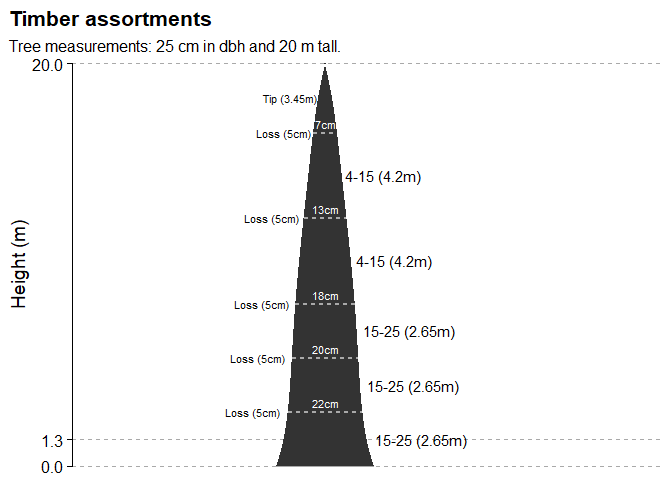

<!-- README.md is generated from README.Rmd. Please edit that file -->

# timbeR

[](https://CRAN.R-project.org/package=timbeR)

The goal of timbeR is to provide functions for estimating log volumes
and quantities from taper functions in the processing of forest
inventories.

## Installation

You can install the CRAN version of the package as follows:

``` r
install.packages("timbeR")
```

You can also install the development version from
[GitHub](https://github.com/) with:

``` r
# install.packages("devtools")
devtools::install_github("sergiocostafh/timbeR")
```

## Example

As a basic example, we can fit a 5th degree polynomial to the
`tree_scaling` dataset.

``` r
library(dplyr)
library(timbeR)

tree_scaling <- tree_scaling %>% 
  mutate(did = di/dbh,
         hih = hi/h)

poli5 <- lm(did~hih+I(hih^2)+I(hih^3)+I(hih^4)+I(hih^5),tree_scaling)
```

And then we define the wood products:

``` r
assortments <- data.frame(
  NAME = c('15-25','4-15'),
  SED = c(15,4),
  MINLENGTH = c(2.65,2),
  MAXLENGTH = c(2.65,4.2),
  LOSS = c(5,5)
)
```

And now we can estimate the volume and quantity of wood products in a
tree stem. For ease of understanding, let’s simulate cutting logs on a
single tree.

``` r
# Tree measurements
dbh <- 25
h <- 20

# Estimate logs volume and quantity
poly5_logs(dbh, h, coef(poli5), assortments)
#> $volumes
#> # A tibble: 1 x 2
#>   `15-25` `4-15`
#>     <dbl>  <dbl>
#> 1   0.293  0.111
#> 
#> $logs
#> # A tibble: 1 x 2
#>   `15-25` `4-15`
#>     <dbl>  <dbl>
#> 1       3      2
```

Finally, we can generate the same result in a visual way, simulating the
position of the logs along the tree stem.

``` r
poly5_logs_plot(dbh, h, coef(poli5), assortments)
```


